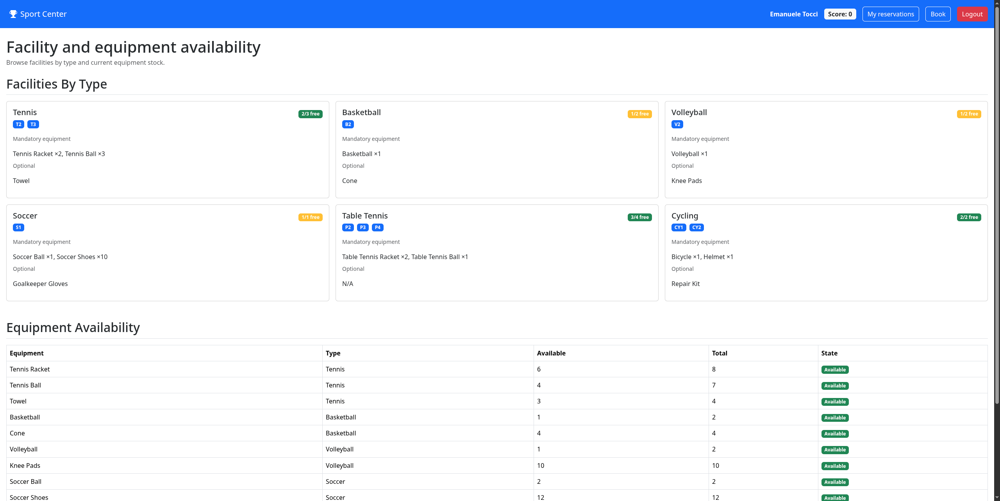

# Exam #3: "Sports"

## Student: s363290 Tocci Emanuele

## React Client Application Routes

- Route `/`: public home page. Shows the facilities grouped by type (how many are free out of the total, with the codes of the free ones) and the availability of every equipment type. Accessible without logging in.
- Route `/login`: login page. Asks for email and password and, for the users who have 2FA enabled, then shows the form for the TOTP code.
- Route `/reservations`: list of the active reservations of the logged-in user, with the equipment of each one and the buttons to modify or delete it.
- Route `/reservations/:reservationId/edit`: page that modifies the equipment of one existing reservation. `reservationId` is the id of the reservation to modify.
- Route `/book`: page that creates a new reservation: choice of the facility type, manual or automatic choice of the facility, and choice of the equipment.
- Route `*`: page shown for any unknown address, with a link back to the home page.

## API Server

### Authentication

- POST `/api/sessions`
  - **Description**: Performs user login using email and password.
  - **Request body**: A JSON object containing `"email"` and `"password"` (e.g., `{"email": "user2@example.com", "password": "Password2!"}`).
  - **Response body**: A JSON object with the authenticated user's information, including `id`, `email`, `name`, `surname`, `score`, `totpSecret`, and `lastTotpStep`.
  - **Error responses**: `401 Unauthorized` (Incorrect email or password).

- POST `/api/login-totp`
  - **Description**: Performs the second authentication step by verifying the TOTP code for users with 2FA enabled.
  - **Request body**: A JSON object containing the 6-digit TOTP code (e.g., `{"code": "478230"}`).
  - **Response body**: A JSON object confirming successful authorization `{"otp": "authorized"}`.
  - **Error responses**: `401 Unauthorized` (Not authenticated / Invalid TOTP), `400 Bad Request` (Cannot authenticate with TOTP).

- GET `/api/sessions/current`
  - **Description**: Checks if the current user is authenticated and returns their session information.
  - **Request body**: None.
  - **Response body**: A JSON object with the authenticated user's details.
  - **Error responses**: `401 Unauthorized` (Not authenticated).

- DELETE `/api/sessions/current`
  - **Description**: Logs out the currently authenticated user and clears the session.
  - **Request body**: None.
  - **Response body**: An empty JSON object `{}`.
  - **Error responses**: None (Returns 200 even if already logged out).

### Facilities and equipment (public)

- GET `/api/facilities`
  - **Description**: Retrieves all facilities of the sport center. It accepts an optional query parameter `status` (e.g., `?status=free` or `?status=booked`) to filter the results.
  - **Request body**: None.
  - **Response body**: An array of facility objects containing `code`, `isBooked`, `facilityTypeId`, and `facilityTypeName`.
  - **Error responses**: `422 Unprocessable Entity` (Invalid filter value).

- GET `/api/equipment`
  - **Description**: Retrieves equipment rules and availability. It accepts an optional query parameter `facilityTypeId` to filter equipment for a specific facility type.
  - **Request body**: None.
  - **Response body**: An array of equipment objects containing `id`, `name`, `totalQuantity`, `availableQuantity`, `minQuantity`, `facilityTypeId`, and `facilityTypeName`.
  - **Error responses**: `422 Unprocessable Entity` (Invalid facilityTypeId value).

- GET `/api/facility-types`
  - **Description**: Retrieves the list of all available facility types.
  - **Request body**: None.
  - **Response body**: An array of facility type objects containing `id` and `name`.
  - **Error responses**: `500 Internal Server Error` (Database error).

### Reservations (login required)

- GET `/api/reservations`
  - **Description**: Retrieves the list of active reservations for the logged-in user, including the rented equipment for each reservation.
  - **Request body**: None.
  - **Response body**: An array of reservation objects, each containing a nested `equipment` array with the rented items (eg. `{ id, userId, facilityCode, facilityTypeId, facilityTypeName, createdAt, equipment: [{ reservationId, equipmentId, name, quantity, minQuantity }] }`).
  - **Error responses**: `401 Unauthorized` (Not authenticated).

- GET `/api/reservations/:id`
  - **Description**: Retrieves a single reservation by its ID (only if it belongs to the logged-in user), along with its rented equipment.
  - **Request body**: None.
  - **Response body**: A JSON object representing the reservation, including its associated `equipment` array.
  - **Error responses**: `401 Unauthorized` (Not authenticated), `404 Not Found` (Reservation not found or belongs to another user), `422 Unprocessable Entity` (Validation errors on ID).

- POST `/api/reservations`
  - **Description**: Creates a new reservation for the logged-in user, books a facility, and reserves the requested equipment.
  - **Request body**: A JSON object specifying `facilityTypeId`, an optional `facilityCode`, and an `equipment` array with `equipmentId` and `quantity` for each item (e.g. `{ facilityTypeId, facilityCode, equipment: [{ equipmentId, quantity }] }`).
  - **Response body**: A JSON object of the newly created reservation, including the nested `equipment` array.
  - **Error responses**: `401 Unauthorized` (Not authenticated), `422 Unprocessable Entity` (Validation errors, rebooking cooldown, missing facility, invalid equipment request, or facility already booked).

- PUT `/api/reservations/:id`
  - **Description**: Modifies the rented equipment of an existing active reservation belonging to the logged-in user.
  - **Request body**: A JSON object containing an `equipment` array with the updated `equipmentId` and `quantity` values.
  - **Response body**: A JSON object representing the updated reservation, including the modified `equipment` array.
  - **Error responses**: `401 Unauthorized` (Not authenticated), `404 Not Found` (Reservation not found or belongs to another user), `422 Unprocessable Entity` (Validation errors, reservation not active, or invalid equipment changes),.

- DELETE `/api/reservations/:id`
  - **Description**: Cancels an active reservation, frees the associated facility and equipment, and applies any penalty to the user's score.
  - **Request body**: None.
  - **Response body**: An empty JSON object `{}` upon successful cancellation.
  - **Error responses**: `401 Unauthorized` (Not authenticated), `404 Not Found` (Reservation not found or belongs to another user), `422 Unprocessable Entity` (Validation errors or reservation not active).

## Database Tables

- Table `users`: the users of the application. Columns: `id` (primary key), `name`, `surname`, `email` (unique), `password_hash`, `salt`, `totp_secret`, `last_totp_step` (last TOTP time step used, against replay), `score`.
- Table `facility_types`: the types of facility of the sport center (tennis, basketball, ...). Columns: `id` (primary key), `name` (unique).
- Table `facilities`: the single facilities. Columns: `code` (primary key, e.g. "T2"), `facility_type_id`, `is_booked` (0 or 1).
- Table `equipment`: the equipment available for rental, with the rule that applies to its facility type. Columns: `id` (primary key), `facility_type_id`, `name` (unique), `total_quantity`, `available_quantity`, `min_quantity` (0 means optional, greater than 0 means mandatory with that minimum).
- Table `reservations`: the reservations. Columns: `id` (primary key), `user_id`, `facility_code`, `created_at`, `status` ("active" or "cancelled"), `released_at` (when it was cancelled, used for the 30-second rule).
- Table `rents`: the equipment rented by every reservation. Columns: `reservation_id` and `equipment_id` (together, the primary key), `quantity`.

## Main React Components

- `App` (in `App.jsx`): root component. It holds the authentication state and the message shown after every operation, and it defines all the routes.
- `Layout` (in `Layout.jsx`): shell shared by every page, made of the navigation bar, the message of the last operation, and the content of the current route.
- `LoginForm` and `TotpForm` (in `Auth.jsx`): the form for email and password, and the form for the TOTP code, which is also where a negative score goes back to zero.
- `Home` (in `Home.jsx`): public home page. It loads the facilities and the equipment once, shows them in a card per facility type and in an availability table.
- `Book` (in `Book.jsx`): page that creates a reservation, with a card to choose the facility and a card to choose the equipment. It handles the manual/automatic choice of the facility and the rules that depend on the score of the user.
- `EquipmentRow` (in `EquipmentRow.jsx`): one editable line of equipment, with the +/- controls. It holds no rule: the limits are computed by the parent, which is why it is shared by the booking page and the modification page.
- `Reservations` (in `Reservations.jsx`): list of the reservations of the user, with the actions to modify and delete them.
- `ReservationEdit` (in `ReservationEdit.jsx`): page that modifies the equipment of one reservation. Every item can be increased or decreased, but a mandatory one never below its minimum quantity.

A detailed overview of React Components is available [here](_DOCS/react_components/react-components-overview.md).

## Screenshot

## Users Credentials

The 2FA secret is the same for every user and it is stored separately for each of them in the database. All the users can therefore log in with the second factor and, by doing so, bring a negative score back to zero.

| Email | Password | Characteristics |
| --- | --- | --- |
| <s363290@studenti.polito.it> | Password1! | No reservation, score 0 |
| <user2@example.com> | Password2! | One active reservation (tennis court T1), score 0 |
| <user3@example.com> | Password3! | One active reservation (basketball court B1), one cancelled, score -1 |
| <user4@example.com> | Password4! | Two active reservations (volleyball court V1, table tennis table P1), two cancelled, score -2 |
