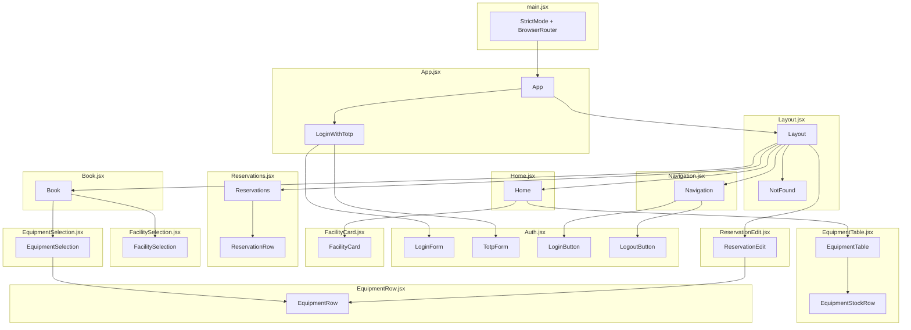

# Client components

Reference of every React component of the client: which file declares it, who
renders it, and what it is responsible for.

Two categories are used throughout:

- **page** — mounted by a `<Route>` in `App.jsx`. It fetches the data it needs
  and owns the state of the screen.
- **reusable** — receives everything through props, performs no request, holds
  no state. Purely presentational.

## Render tree

The arrows out of `Layout` are the nested routes: React Router puts the matched
page into the `<Outlet />` of `Layout`, so at runtime exactly one of them is
mounted at a time.

## All components

| Component | File | Type | Rendered by |
| --- | --- | --- | --- |
| `App` | `App.jsx` | root | `main.jsx` |
| `LoginWithTotp` | `App.jsx` | router | `App`, at `/login` |
| `Layout` | `Layout.jsx` | shell | `App`, at `/` |
| `NotFound` | `Layout.jsx` | page | `App`, at `*` |
| `Navigation` | `Navigation.jsx` | reusable | `Layout` |
| `LoginForm` | `Auth.jsx` | page | `LoginWithTotp` |
| `TotpForm` | `Auth.jsx` | page | `LoginWithTotp` |
| `LoginButton` | `Auth.jsx` | reusable | `Navigation` |
| `LogoutButton` | `Auth.jsx` | reusable | `Navigation` |
| `Home` | `Home.jsx` | page | `App`, index route |
| `FacilityCard` | `FacilityCard.jsx` | reusable | `Home` |
| `EquipmentTable` | `EquipmentTable.jsx` | reusable | `Home` |
| `EquipmentStockRow` | `EquipmentTable.jsx` | private | `EquipmentTable` |
| `Reservations` | `Reservations.jsx` | page | `App`, at `/reservations` |
| `ReservationRow` | `Reservations.jsx` | private | `Reservations` |
| `ReservationEdit` | `ReservationEdit.jsx` | page | `App`, at the edit route |
| `Book` | `Book.jsx` | page | `App`, at `/book` |
| `FacilitySelection` | `FacilitySelection.jsx` | reusable | `Book` |
| `EquipmentSelection` | `EquipmentSelection.jsx` | reusable | `Book` |
| `EquipmentRow` | `EquipmentRow.jsx` | reusable | `EquipmentSelection`, `ReservationEdit` |

`private` means declared in the file of its only parent and not exported.
`EquipmentRow` is the only component with two parents, which is why it has a
file of its own.

## What each file declares

### `App.jsx`

`App` holds the authentication state and the feedback message, and defines every
route. `LoginWithTotp` decides which of the three login screens to show.

| Item | Kind |
| --- | --- |
| `loggedIn`, `loggedInTotp`, `user`, `message` | state |
| `showSuccess(text)` | shows a green message |
| `handleErrors(err)` | shows a red message, whatever the rejection shape |
| `handleLogin(credentials)` | logs in, re-throws so `LoginForm` can show the error |
| `handleLogout()` | clears the local state in a `finally`, even on failure |
| `refreshUserInfo()` | re-reads the user, needed after a delete or a TOTP login |

### `Layout.jsx`

The shell shared by every page: navigation bar, feedback `Alert`, `<Outlet />`.
`NotFound` is the page of the catch-all route.

### `Navigation.jsx`

The top bar. Shows the name, the score badge (red when negative) and the links,
or a single Login button for a guest.

### `Auth.jsx`

Groups everything about authentication. `LoginForm` and `TotpForm` are full
screens; `LoginButton` and `LogoutButton` are the two navbar buttons, which is
why this file is imported by both `App.jsx` and `Navigation.jsx`.

`doTotpVerify()`, inside `TotpForm`, is where a negative score goes back to zero.

### `Home.jsx`

The public page. Runs both fetches once and distributes the result: the whole
equipment list is filtered per card, so no card performs a request of its own.

| Item | Kind |
| --- | --- |
| `facilityGroups`, `equipmentList` | state |
| `waitingFacilities`, `waitingEquipment` | spinner flags, combined into one |

### `FacilityCard.jsx`

One card per facility type: free/total badge, codes of the free facilities, and
the mandatory and optional equipment as text. `getBadgeColor(free)` picks the
badge colour: red for none free, yellow for one, green for two or more.

### `EquipmentTable.jsx`

The availability table of the home page. `getStockStatus(qty)` returns the
variant and the label of the badge.

### `Reservations.jsx`

The list of the user's active reservations. `handleDelete(id)` deletes one,
removes it from the local state with a `filter`, and calls `refreshUserInfo`
because the score changed on the server.

### `ReservationEdit.jsx`

Modifies the equipment of one reservation. The most stateful component.

| Item | Kind |
| --- | --- |
| `reservation`, `equipmentRules` | state, loaded from the server |
| `quantities` | state, edited by the buttons |
| `initialQuantities` | state, frozen at load time, needed by `getEffectiveMax` |
| `getEffectiveMin(eq)` | lower limit: `minQuantity`, so 0 for optional items |
| `getEffectiveMax(eq)` | upper limit: free units plus the ones already held |
| `handleQuantityChange(eq, delta)` | clamps the new value between the two limits |

### `Book.jsx`

Creates a reservation: choice of the type, manual or automatic choice of the
facility, choice of the equipment.

| Item | Kind |
| --- | --- |
| `selectedTypeId`, `mode`, `selectedFacilityCode` | state, the facility choice |
| `equipmentRules`, `quantities` | state, the equipment choice |
| `buildInitialQuantities(rules)` | mandatory items start at their minimum, optional at 0 |
| `findUnavailableMandatory(rules)` | mandatory items that cannot be satisfied, so the type cannot be booked |
| `handleQuantityChange(eq, delta)` | clamps between `minQuantity` and `availableQuantity` |

### `FacilitySelection.jsx`

The "Facility" card of the form: type dropdown, manual/automatic toggle, radio
list of the free facilities.

### `EquipmentSelection.jsx`

The "Equipment" card of the form. Applies the booking rules and delegates every
line to `EquipmentRow`.

### `EquipmentRow.jsx`

One editable line of equipment. Holds no rule: the parent passes `canDecrease`
and `canIncrease` already computed, which is what makes it usable by both the
creation and the modification screen with different limits.

## Shared modules

| File | Exports | Used by |
| --- | --- | --- |
| `API.js` | `API` | `App`, `Auth`, `Home`, `Reservations`, `ReservationEdit`, `Book` |
| `utils.js` | `formatName(name)` | every file that displays a name |
| `utils.js` | `groupFacilitiesByType(facilities)` | `Home` only |

Only the pages import `API.js`. A component that imports it is a page by
definition, and a reusable component that starts importing it has stopped being
reusable.
